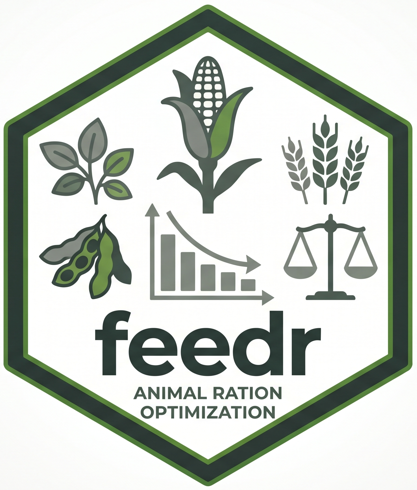

<div align="center">
  
  <h1>feedr</h1>
  <p><strong>Open-source animal ration optimization for R</strong></p>

  [](https://github.com/austin-putz/feedr/actions/workflows/R-CMD-check.yaml)
  [](https://www.gnu.org/licenses/gpl-3.0)
  [](https://lifecycle.r-lib.org/articles/stages.html)

  <br/>
</div>

---

`feedr` is a pipe-first, table-first R package for livestock diet formulation, feed optimization, and animal nutrition modeling — a modern, open-source alternative to commercial ration balancing tools.

It uses a local [DuckDB](https://duckdb.org/) backend for fast, file-free data storage with explicit data provenance, and supports both deterministic and stochastic least-cost formulation.

> **Status:** early development — the API examples below describe the intended design, not a fully implemented feature set.

---

## Features

- **Pipe-first API** — chain operations naturally with `|>` and `dplyr`
- **Table-first workflows** — filter ingredient and price tables, then pass them into generalized verbs
- **Local DuckDB backend** — no server, no files, fast columnar storage
- **Readable identifiers** — short symbols like `CYD2`, `SBM48`, `DDGS`, `MCP` throughout
- **Explicit units and basis** — separate `unit_id` and `basis` fields; filter by `"as_fed"` or `"dry_matter"`
- **Auditable data** — seed/reference rows are protected; user lab values and project overrides are tracked separately
- **Open source** — GPL-3-or-later

---

## Intended Workflow

```r
library(feedr)
library(dplyr)

feedr <- init_feedr_db()

ingredients <- feedr |>
  get_table("ingredients") |>
  filter(
    species == "swine",
    ingredient_symbol %in% c("CYD2", "SBM48", "DDGS", "MCP", "LIME")
  )

prices <- feedr |>
  get_table("prices") |>
  filter(
    market == "central_iowa",
    basis == "as_fed"
  )

ingredients |>
  formulate_diet(
    spec = "grower_standard",
    prices = prices,
    constraints = grower_limits
  ) |>
  solve_diet()
```

### Adding Custom Nutrient Values

The write API is also pipe-first. Select a table, then insert or modify rows with `mutate_table()`:

```r
feedr |>
  get_table("nutrient_values") |>
  mutate_table(
    ingredient_symbol = "CYD2",
    nutrient_id       = "me_swine",
    nutrient_value    = 3310,
    unit_id           = "kcal_kg",
    basis             = "as_fed",
    source_type       = "user_lab",
    source_id         = "lab_oct2025",
    .mode             = "insert"
  )
```

The same mutation approach works across nutrient values, prices, ingredient symbols, project metadata, and user-defined extension fields.

---

## Design Principles

| Principle | Description |
|-----------|-------------|
| Table-first | Users filter tables with `dplyr`, then pass them into generalized verbs |
| Few core functions | Prefer `get_table()` and `mutate_table()` over many narrow helpers |
| Readable identifiers | Short ingredient symbols (`CYD2`, `SBM48`) for user-facing code |
| Explicit units | `unit_id` and `basis` kept separate so users can filter precisely |
| Auditable data | Seed rows are protected; users add lab values as new rows |

---

## Development Roadmap

**Near-term**

1. Implement `init_feedr_db()` and the `feedr_session` object
2. Implement `get_table()` for lazy DuckDB table access
3. Implement pipe-first `mutate_table()` with row policies and audit logging
4. Create a minimal schema for ingredients, nutrient values, prices, units, requirements, and constraints
5. Add deterministic least-cost formulation with explicit units, basis, and provenance

**Longer-term**

- Stochastic formulation from historical prices and nutrient variability
- Reusable price scenarios
- Requirement equations and animal profiles
- Formulation diagnostics and infeasibility explanations
- Shiny or companion GUI support

---

## CI

GitHub Actions runs R package checks on every push and pull request:

- Dependency installation
- Package build checks
- `R CMD check`
- Tests under `tests/testthat/`

---

## License

`feedr` is licensed under [GPL-3-or-later](LICENSE).
